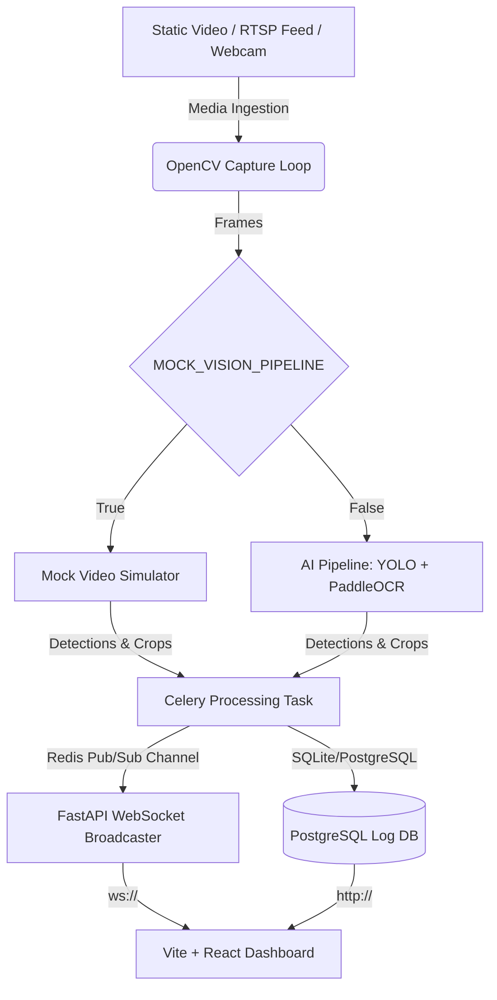

# CÉLIA Plate Log: ANPR & Vehicle Intelligence Web SaaS

This repository contains the complete, production-grade source code for a high-performance Automatic Number Plate Recognition (ANPR) and Vehicle Intelligence Web SaaS. 

The application integrates **Ultralytics YOLO** and **PaddleOCR** in a decoupled two-stage computer vision pipeline, utilizing Celery queues and Redis Pub/Sub to track vehicle features and plates asynchronously, and serves telemetry to a Tailwind-styled dark dashboard via WebSockets.

---

## 1. System Architecture



1. **FastAPI Web Server**: Exposes REST interfaces to upload media or launch camera feeds, mounts static assets, serves log queries, and handles WebSocket streaming.
2. **Celery Processing Worker**: Ingests frames using OpenCV, processes frames through the AI Pipeline, writes logs to PostgreSQL, and pushes live overlays to Redis.
3. **Redis Channel (Pub/Sub)**: Relays video frame updates and event streams between worker processes and API processes.
4. **PostgreSQL**: Stores persistent historical intelligence records (UUID, timestamps, labels, models, confidence, crops).
5. **Tailwind CSS Dashboard**: Modern dark-themed workspace presenting live playbacks, real-time log tables, analytical distributions, and database filters.

---

## 2. Fast Launch (Docker Compose)

The system is configured to work out-of-the-box using simulated vision telemetry (`MOCK_VISION_PIPELINE=True`) so developers can validate compilation and system features instantly without downloading heavy model weights or requiring a GPU.

### Setup and Start
Ensure you have Docker and Docker Compose installed, then run:
```bash
docker-compose up --build
```

- **Frontend Application**: [http://localhost:5173](http://localhost:5173)
- **FastAPI Core Swagger Docs**: [http://localhost:8000/docs](http://localhost:8000/docs)
- **FastAPI API Base**: [http://localhost:8000/api/v1](http://localhost:8000/api/v1)

---

## 3. Deploying Real AI Inference

To toggle the application from simulated to real AI models (YOLO + PaddleOCR):

1. **Update Environment**:
   In `docker-compose.yml`, change `MOCK_VISION_PIPELINE` to `False` for both `backend` and `celery_worker` services:
   ```yaml
   environment:
     - MOCK_VISION_PIPELINE=False
   ```

2. **Mount Weights**:
   Ensure you provide paths to your custom/fine-tuned YOLO models (`YOLO_VEHICLE_MODEL` and `YOLO_PLATE_MODEL`). The standard `yolov8n.pt` will automatically download from Ultralytics on first boot.

3. **Inference Hardware Acceleration**:
   - For CPU setups, libraries run under OpenVINO/ONNX configurations.
   - For CUDA (NVIDIA GPU) acceleration in Docker, configure the NVIDIA Container Toolkit on your host, and add the GPU resource deploy sections inside `docker-compose.yml`.

---

## 4. Normalization and Moroccan Plates
The vision pipeline parses and normalizes OCR readouts using regex:
- **Moroccan Format**: Detects and groups alphanumeric plates like `12345-أ-6` or `12345/أ/6` using the Unicode range matching (`[\u0600-\u06FF]`).
- **Standard Alphanumeric**: Filters and cleans global alphanumeric plates between 5-10 characters long, formatting to uppercase strings.
