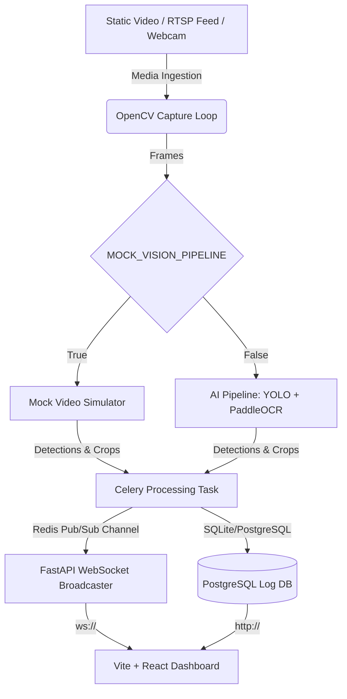

# Gatelook: Intelligent ANPR & Vehicle Telemetry SaaS

Gatelook is a high-performance Automatic Number Plate Recognition (ANPR) and Vehicle Intelligence Web SaaS designed for real-time edge security. 

The application integrates **Ultralytics YOLO** and **PaddleOCR** in a decoupled two-stage computer vision pipeline, utilizing Celery queues and Redis Pub/Sub to track vehicle features, colors, and plates asynchronously. Telemetry and live feeds are served to an adaptive theme-responsive dashboard via WebSockets.

---

## 1. System Architecture



1. **FastAPI Web Server**: Exposes REST interfaces to upload media, mount static assets, serve log queries, and broadcast WebSocket video/event streams.
2. **Celery Processing Worker**: Ingests camera streams using OpenCV, processes frames through the AI Pipeline, persists logs to PostgreSQL, and relays live overlays to Redis.
3. **Redis Pub/Sub**: Relays real-time frame telemetry and event data from worker processes to active WebSocket clients.
4. **PostgreSQL**: Stores persistent historical intelligence logs (UUID, timestamps, labels, models, colors, confidence, crops).
5. **Adaptive UI Dashboard**: Premium web application featuring dynamic glassmorphism panels, Lucide icon design systems, dark/light/system theme toggles, live session trackers, and historical log filters.

---

## 2. Fast Launch (Docker Compose)

The system is configured to run out-of-the-box using simulated vision telemetry (`MOCK_VISION_PIPELINE=True`) so you can validate build, compilation, and system features instantly without downloading heavy model weights.

### Setup and Start
Ensure you have Docker and Docker Compose installed, then run:
```bash
docker-compose up --build
```

- **Frontend Application**: [http://localhost:5173](http://localhost:5173)
- **FastAPI Core Swagger Docs**: [http://localhost:8000/docs](http://localhost:8000/docs)
- **FastAPI API Base**: [http://localhost:8000/api/v1](http://localhost:8000/api/v1)

---

## 3. Deploying Real AI Inference

To toggle the application from simulated to real AI models (YOLO + PaddleOCR):

1. **Update Environment**:
   In `docker-compose.yml`, change `MOCK_VISION_PIPELINE` to `False` for both `backend` and `celery_worker` services:
   ```yaml
   environment:
     - MOCK_VISION_PIPELINE=False
   ```

2. **Mount Weights**:
   Ensure you provide paths to your custom/fine-tuned YOLO models (`YOLO_VEHICLE_MODEL` and `YOLO_PLATE_MODEL`). The standard `yolov8n.pt` will automatically download from Ultralytics on first boot.

3. **Inference Hardware Acceleration**:
   - For CPU setups, libraries run under OpenVINO/ONNX configurations.
   - For CUDA (NVIDIA GPU) acceleration in Docker, configure the NVIDIA Container Toolkit on your host, and add the GPU resource deploy sections inside `docker-compose.yml`.

---

## 4. Vehicle Attribute Mapping & Moroccan Plate Parsing
The AI pipeline parses and normalizes OCR readouts using regex:
- **Moroccan Format**: Detects and groups Moroccan alphanumeric plates like `12345-أ-6` or `12345/أ/6` using Unicode range matching (`[\u0600-\u06FF]`). Only valid Moroccan plates are logged and cropped to disk, filtering out decals, watermarks, or false positives.
- **Grayscale and Paint Pixel-Binning**: Leverages HSV priority color mapping (rather than simple averages) to classify vehicle paint colors (`Blue`, `Red`, `Green`, `Orange/Yellow`, `Purple`, `White`, `Black`, `Grey`).
- **Vehicle Aspect Ratio Matching**: Differentiates hatchback models (`Dacia Sandero`) from sedan models (`Dacia Logan`) using fine-tuned bounding box ratios.
- **De-duplication**: Tracks session-wide processed plates to prevent duplicate logs for the same vehicle track ID, while dynamically updating crop files on disk with the highest confidence read.
